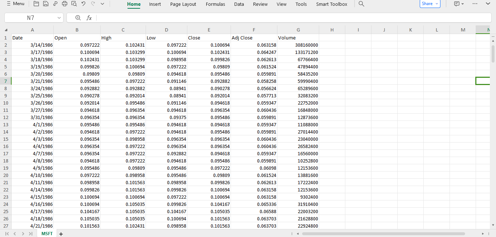
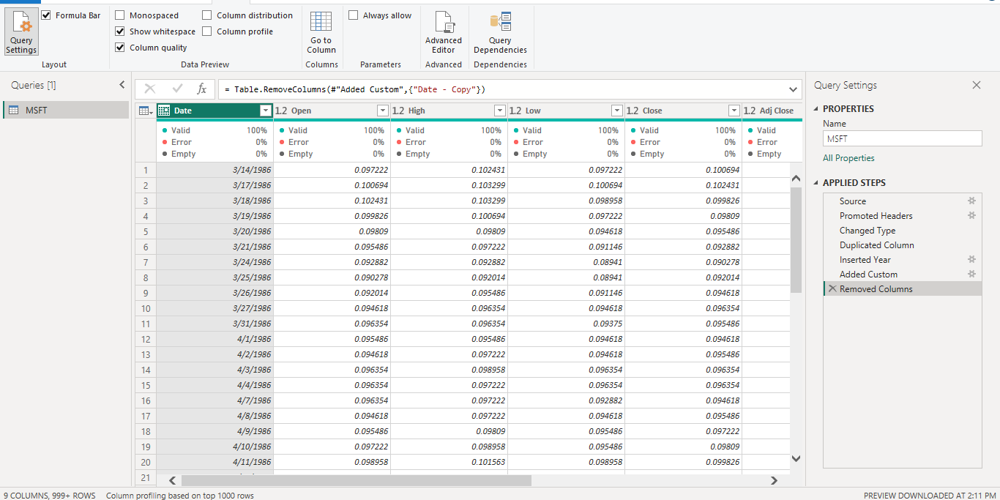
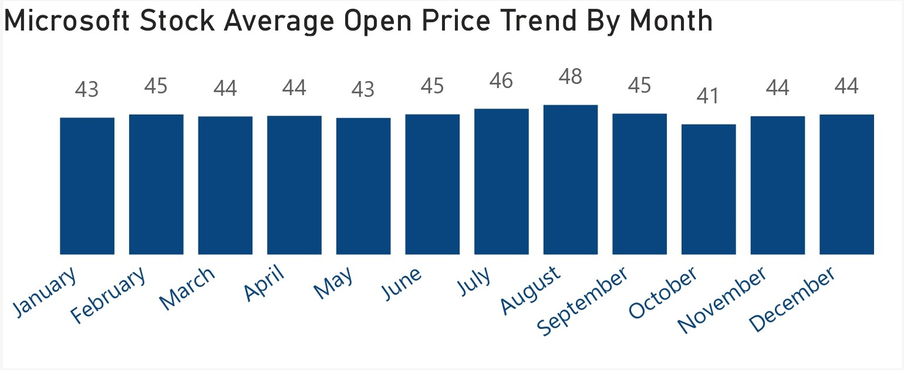

# Microsoft Stock Market (1986-2022) Analysis

## Project Overview

### Introduction:
The __Microsoft Stock Market (1986-2022) Analysis__ project aims to delve into the historical performance of Microsoft Corporation's stock in the period spanning from its initial public offering (IPO) in 1986 to the end of 2022. This comprehensive analysis will provide insights into the long-term trends, volatility, key events, and factors influencing Microsoft's stock market performance over more than three decades.

### Objectives:
- To analyze the historical stock average open price by month.
- To analyze the historical stock average close price by month.
- To analyze the Microsoft stock volume traded bo days of the week.
- To identify Microsoft's stocks high, low, and close price trend over time.
- To identify Microsoft's stocks prices cumulative returns trend over time.

## Expected Ouctomes:
- Clear insights into monthly average opening prices, revealing historical trends and fluctuations.
- Understanding of monthly average closing prices, highlighting historical patterns and variations.
- Identification of trading volume patterns across weekdays, providing insights into market activity.
- Recognition of trends in high, low, and close prices over time, aiding in understanding stock performance dynamics.
- Analysis of cumulative returns trend, offering insights into overall investment performance.

### Dataset Overview
This dataset contains a Stock Market Analysis of Microsoft Corporation (MSFT) from its Founding / Listing Years which are 1986 to 2022. In this dataset, daily price and the changes within the day can be seen. The highest and lowest prices for every single day help in identifying patterns at the minuscule level. Volume per day is also recorded. The dataset used in this analysis was provided by [Quantum Analytics](https://www.quantumanalyticsco.org/). You can also download this dataset [here](images/MSFT.csv). It is a .csv file of Microsoft Stock market trades between 1986 and 2022, displaying updates of OHLC (Open, High, Low, Close), Trading Date, Volume, and Adjusted Close. 

The dataset contains 1 sheet/table,  7columns, and 9,204 rows of data. The columns includes:
- __Open:__ The price at which a stock's first trade occurs when the market opens for the day. It indicates the starting point for trading activity and sets the initial value of the stock for that day.
- __High:__ The highest price at which a stock traded during the trading day. It represents the peak value reached by the stock's price within the given timeframe.
- __Low:__ The lowest price at which a stock traded during the trading day. It represents the lowest point reached by the stock's price within the given timeframe.
- __Close:__ The price at which the last trade occurred when the market closed for the day. It indicates the final value of the stock for that trading session and is often considered significant for technical analysis and decision-making.
- __Date:__ The date on which the trading activity occurred, providing a chronological reference for the stock market data.
- __Volume:__ The total number of shares of a stock traded during a particular trading day. It indicates the level of activity or liquidity in the market for that stock on that day. Higher volume typically suggests increased investor interest or trading activity.
- __Adjusted Close:__ The closing price of a stock adjusted for factors such as dividends, stock splits, or other corporate actions that may affect the stock's price. This adjusted value helps in providing a more accurate representation of the stock's true performance over time, particularly when comparing historical data.

### Tools Used
1. Power Query Editor
    - Was used to:
        1. Extract,
        2. Transform, and
        3. Load all the datasets for this analysis.
           
2. Power BI (Was used to create reports and dashboard for this analysis)
    - The following Power BI Features were incorporated:
        1. DAX
        2. Quick Measures
        3. Page Navigation
        4. Filters
        5. Tooltips

### Data Cleaning, Transformation and Loading using the Power Query Editor:
1. Changed all column data types to the appropriate data types.
2. Duplicated the __"Date"__ column.
3. Created a new column __"Year"__ from the duplicate __Date__ column and changed the data type to int64.
4. Created a new custom column from the __"Date"__ column named __"DayOfWeek"__ (sunday - saturday) using the "If function".
5. Removed the initial duplicate column created from the __Date__ column.
6. Made sure that there was no columns with error or null values, and made sure all columns reported a 100% valid column quality.

**Raw Data**
- Below a screenshot of a part of the raw data in .csv file format. You can download the dataset [here](images/MSFT.csv).

**Cleaned Data Power Query Editor screenshot**
- Below is a screenshot of a part of the cleaned data in power query editor. You can access the full Power BI project document [here](https://github.com/Ugochukwuodinaka/Microsoft-Stock-Market-Analysis/blob/main/MICROSOFT%20STOCK%20MARKET%20ANALYSIS.pbix).

## Data Modelling
No data modelling was required since we need just a table for the analysis.

## Visualization in Power BI:
### Report Image
_Analysis_Dashboard.jpg)

### Project Analysis:
From the analysis, i made the Key Performance findings below:
- The Total Number of Trades is __9,204__.
- Total Traded Volume is __536bn__.
- Average Open Price is __$44.38__
- Average Close Price is __$44.39__.
- Average Adjusted Close Price is __$39.20__.
- Average Price Range is __$0.96

- 
- **Microsoft Stock Average Open Price Trend By Month:**
- In this analysis,
