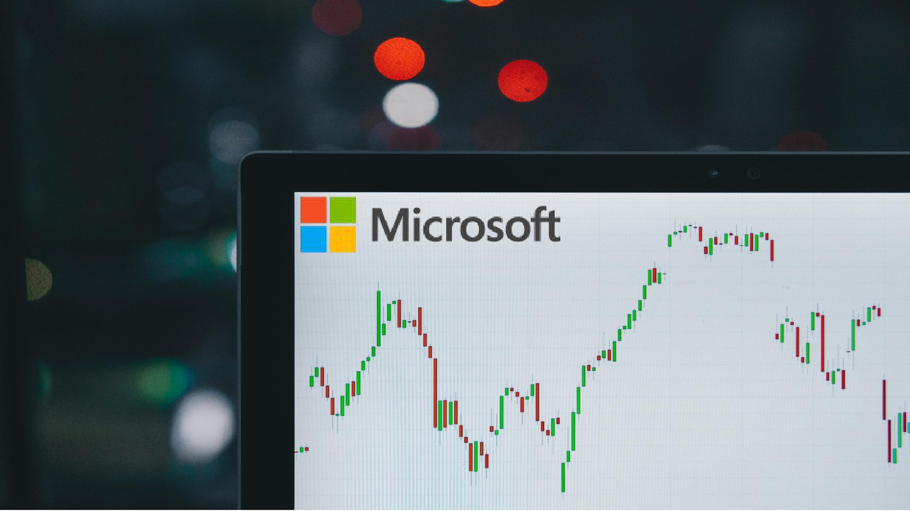

# Microsoft Stock Market (1986-2022) Analysis

## Project Overview

### Introduction:
The __Microsoft Stock Market (1986-2022) Analysis__ project aims to delve into the historical performance of Microsoft Corporation's stock in the period spanning from its initial public offering (IPO) in 1986 to the end of 2022. This comprehensive analysis will provide insights into the long-term trends, volatility, key events, and factors influencing Microsoft's stock market performance over more than three decades.

### Objectives:
- To analyze the historical stock average open price by month.
- To analyze the historical stock average close price by month.
- To analyze the Microsoft stock volume traded bo days of the week.
- To identify Microsoft's stocks high, low, and close price trend over time.
- To identify Microsoft's stocks prices cumulative returns trend over time.

## Expected Outcomes:
- Clear insights into monthly average opening prices, revealing historical trends and fluctuations.
- Understanding of monthly average closing prices, highlighting historical patterns and variations.
- Identification of trading volume patterns across weekdays, providing insights into market activity.
- Recognition of trends in high, low, and close prices over time, aiding in understanding stock performance dynamics.
- Analysis of cumulative returns trend, offering insights into overall investment performance.

### Dataset Overview
This dataset contains a Stock Market Analysis of Microsoft Corporation (MSFT) from its Founding / Listing Years which are 1986 to 2022. In this dataset, daily price and the changes within the day can be seen. The highest and lowest prices for every single day help in identifying patterns at the minuscule level. Volume per day is also recorded. The dataset used in this analysis was provided by [Quantum Analytics](https://www.quantumanalyticsco.org/). You can also download this dataset [here](images/MSFT.csv). It is a .csv file of Microsoft Stock market trades between 1986 and 2022, displaying updates of OHLC (Open, High, Low, Close), Trading Date, Volume, and Adjusted Close. 

The dataset contains 1 sheet/table,  7columns, and 9,204 rows of data. The columns includes:
- __Open:__ The price at which a stock's first trade occurs when the market opens for the day. It indicates the starting point for trading activity and sets the initial value of the stock for that day.
- __High:__ The highest price at which a stock traded during the trading day. It represents the peak value reached by the stock's price within the given timeframe.
- __Low:__ The lowest price at which a stock traded during the trading day. It represents the lowest point reached by the stock's price within the given timeframe.
- __Close:__ The price at which the last trade occurred when the market closed for the day. It indicates the final value of the stock for that trading session and is often considered significant for technical analysis and decision-making.
- __Date:__ The date on which the trading activity occurred, providing a chronological reference for the stock market data.
- __Volume:__ The total number of shares of a stock traded during a particular trading day. It indicates the level of activity or liquidity in the market for that stock on that day. Higher volume typically suggests increased investor interest or trading activity.
- __Adjusted Close:__ The closing price of a stock adjusted for factors such as dividends, stock splits, or other corporate actions that may affect the stock's price. This adjusted value helps in providing a more accurate representation of the stock's true performance over time, particularly when comparing historical data.

### Tools Used
1. Power Query Editor
    - Was used to:
        1. Extract,
        2. Transform, and
        3. Load all the datasets for this analysis.
           
2. Power BI (Was used to create reports and dashboard for this analysis)
    - The following Power BI Features were incorporated:
        1. DAX
        2. Quick Measures
        3. Page Navigation
        4. Filters
        5. Tooltips

### Data Cleaning, Transformation and Loading using the Power Query Editor:
1. Changed all column data types to the appropriate data types.
2. Duplicated the __"Date"__ column.
3. Created a new column __"Year"__ from the duplicate __Date__ column and changed the data type to int64.
4. Created a new custom column from the __"Date"__ column named __"DayOfWeek"__ (sunday - saturday) using the "If function".
5. Removed the initial duplicate column created from the __Date__ column.
6. Made sure that there was no columns with error or null values, and made sure all columns reported a 100% valid column quality.

**Raw Data**
- Below a screenshot of a part of the raw data in .csv file format. You can download the dataset [here](images/MSFT.csv).

**Cleaned Data Power Query Editor screenshot**
- Below is a screenshot of a part of the cleaned data in power query editor. You can access the full Power BI project document [here](https://github.com/Ugochukwuodinaka/Microsoft-Stock-Market-Analysis/blob/main/MICROSOFT%20STOCK%20MARKET%20ANALYSIS.pbix).

## Data Modelling
No data modelling was required since we need just a table for the analysis.

## Visualization in Power BI:
### Report Image
_Analysis_Dashboard.jpg)

### Project Analysis:
From the analysis, i made the Key Performance findings below:
- The Total Number of Trades is __9,204__.
- Total Traded Volume is __536bn__.
- Average Open Price is __$44.38__
- Average Close Price is __$44.39__.
- Average Adjusted Close Price is __$39.20__.
- Average Price Range is __$0.96__.

- 
- **Microsoft Stock Average Open Price Trend By Month:**
- In this analysis of the monthly average opening prices for Microsoft stock from 1986 to 2022 several interesting trends and fluctuations are revealed:
- __Seasonal Variation:__ There is a noticeable seasonal variation in the average opening prices throughout the year. The months of July and August consistently show higher average opening prices, peaking at $46.33 and $47.55 respectively. This could be attributed to factors such as positive earnings reports, product launches, or market sentiment during the summer months.
- __Yearly Trends:__ Despite seasonal variations, there are also broader yearly trends in the average opening prices. For example, there appears to be a general upward trend in opening prices from January to August, with a peak in August, followed by a decrease in September and October before stabilizing towards the end of the year. This pattern suggests potential market cycles or investor behavior influenced by macroeconomic factors.
- __Outliers and Anomalies:__ Some months exhibit deviations from the overall trend. For instance, October stands out with a significantly lower average opening price of $41.39 compared to the preceding months. This could be due to specific events or market conditions affecting Microsoft's stock performance during that month.
- __Market Sentiment and Events:__ Fluctuations in average opening prices may also reflect changes in market sentiment or significant events related to Microsoft Corporation. For instance, periods of high average opening prices may coincide with positive news such as strong earnings reports, successful product launches, or strategic acquisitions.
- __Investor Behavior:__ Investors' perceptions and expectations regarding Microsoft's future prospects can influence the monthly average opening prices. Positive news or optimism about the company's growth potential may drive prices higher, while negative developments or concerns about market conditions could lead to lower opening prices.

- 
- **Microsoft Stock Average Close Price Trend By Month:**
- In this analysis of the monthly average close prices for Microsoft stock from 1986 to 2022 several notable patterns and variations shows that:
- __Seasonal Patterns:__ Notably, July and August consistently exhibit higher average close prices, reaching peaks of $46.33 and $47.55 respectively. This suggests a seasonal uptrend, likely influenced by positive market sentiment during the summer months.
- __Yearly Variations:__ Over the years, average close prices generally follow an upward trajectory from January to August, with a peak in August, followed by a dip in September and October before stabilizing towards the year's end. This cyclical pattern indicates potential market cycles driven by macroeconomic factors and investor sentiment.
- __Outliers and Anomalies:__ Certain months, such as October with an average close price of $41.39, deviate significantly from the overall trend. Such anomalies may be attributed to specific events affecting Microsoft's stock performance during those periods.
- __Market Sentiment and Events:__ Fluctuations in average close prices often coincide with changes in market sentiment or significant company-related events. Higher average close prices may be associated with positive news like strong earnings or successful product launches, while lower prices may reflect negative developments or market uncertainties.
- __Investor Sentiment:__ Investor sentiment plays a pivotal role in shaping monthly average close prices. Positive sentiment, driven by favorable news or growth prospects, tends to drive prices up, while negative sentiment can lead to declines.

- 
- **Microsoft Stocks High, Low and Close Price Trend Over Time:**
- Analyzing the trends in Microsoft's high, low, and close prices over time provides insights into the stock's performance and market dynamics:
- __High Price Trend:__ Microsoft's high prices have shown steady growth over the years, with occasional fluctuations. The highest point was reached in 2021, reaching an impressive $70,060.54. This upward trend reflects the company's overall success and market perception of its growth prospects.
- __Low Price Trend:__ Similarly, Microsoft's low prices have generally followed an upward trajectory, albeit with occasional dips. The lowest point was recorded in 1986 at $23.51, and since then, the low prices have steadily increased. This suggests improved market stability and confidence in Microsoft's performance over time.
- __Close Price Trend:__ The close prices of Microsoft stock also exhibit a consistent upward trend, reflecting the company's long-term growth and profitability. The highest close price was observed in 2021 at $69,537.07. This indicates sustained investor confidence and positive market sentiment towards Microsoft.
- In summary, the analysis of high, low, and close price trends reveals Microsoft's remarkable growth and resilience in the stock market over the past several decades. Investors can use these insights to assess the stock's historical performance and make informed decisions regarding investment strategies.

- 
- **Microsoft Stocks Prices Cumulative Returns Trend Over Time:**
- Analyzing the cumulative returns trend of Microsoft stock prices over time provides insights into the stock's overall performance and growth trajectory:
- __Steady Growth:__ Microsoft's cumulative returns have shown consistent growth over the years, reflecting the company's long-term success and value appreciation. The cumulative returns have steadily increased from $14.99 in 1986 to $50,056.25 in 2022, indicating substantial wealth creation for investors over the analyzed period.
- __Acceleration in Growth:__ The pace of cumulative returns growth has accelerated in recent years, particularly from the late 1990s onwards. This period coincides with significant milestones and developments for Microsoft, such as the expansion into new markets, strategic acquisitions, and the emergence of innovative technologies.
- __Market Resilience:__ Despite occasional downturns and market fluctuations, Microsoft's cumulative returns have demonstrated resilience and the ability to recover and continue on an upward trajectory. This resilience reflects the company's strong fundamentals, diverse revenue streams, and adaptability to changing market conditions.
- __Outperformance:__ Microsoft's cumulative returns have consistently outperformed broader market indices and benchmarks, highlighting the company's exceptional performance compared to its peers and the broader market. This outperformance underscores Microsoft's position as a leading player in the technology sector and its ability to deliver value to shareholders over time.
- __Investment Potential:__ The analysis of cumulative returns trend suggests that Microsoft stock has been a rewarding investment over the long term, offering investors significant returns and capital appreciation. This may attract further investor interest and confidence in Microsoft's future growth prospects.

- 
- **Microsoft Stock Traded Volume Over Time:**
- In analyzing the traded volume of Microsoft stock over time, i provided insights into market activity and investor interest:
- __Historical Trends:__ The traded volume of Microsoft stock has fluctuated over the years, reflecting changes in market conditions, investor sentiment, and company performance. From 1986 to 2022, total traded volumes have varied significantly, with peaks and troughs observed at different points in time.
- __Peak Years:__ Some years stand out with exceptionally high traded volumes, indicating heightened market activity and investor participation. For instance, 1987 saw a substantial increase in traded volume, reaching 23,920,171,200bn shares. This could be attributed to significant market events, such as the stock market crash of that year.
- __Recent Trends:__ In recent years, there has been a general decline in traded volumes compared to previous decades which ended with 5,690,658,600bn shares traded in 2022. However, there are still fluctuations from year to year, reflecting ongoing market dynamics and changes in investor behavior.
- __Market Sentiment:__ Traded volume often reflects investor sentiment and interest in a particular stock. Higher volumes may indicate increased investor confidence or speculation, while lower volumes may suggest caution or lack of interest.
- __Implications for Investors:__ An understanding of traded volume trends can help investors gauge market sentiment and identify potential trading opportunities. High volumes may present opportunities for short-term trading or liquidity, while low volumes may signal a lack of market interest or potential price volatility.

- 
- **Microsoft Stock Prices Trend Over Time:**
- This analysis of the trend of Microsoft stock prices over time reveals significant insights on growth and volatility which i shared below:
- __Continuous Growth:__ Microsoft's stock prices have shown remarkable growth over the years, starting from $23.89 in 1986 and reaching $50,233.47 in 2022. This consistent upward trend reflects the company's strong performance, innovation, and market dominance in the technology sector.
- __Volatility:__ Despite the overall upward trajectory, Microsoft's stock prices have experienced periods of volatility and fluctuations. For instance, there are noticeable fluctuations in the early years, followed by a more stable growth trajectory in the later years. The volatility may be influenced by various factors, including market conditions, company earnings, and industry trends.
- __Milestone Years:__ Several years stand out with significant milestones in Microsoft's stock prices. For example, 1999 saw a substantial increase in stock price, reaching $11,029.22, driven by the dot-com boom and widespread adoption of Microsoft products. Similarly, 2021 witnessed a surge in stock price value to $69,537.07, reflecting strong financial performance and investor optimism.
- __Market Response:__ Microsoft's stock prices often respond to key events and announcements, such as product launches, earnings reports, and strategic initiatives. Positive news tends to drive prices higher, while negative developments may lead to temporary declines. 
- __Long-Term Investment:__ Despite short-term fluctuations, the overall trend of Microsoft's stock prices demonstrates the company's resilience and long-term growth potential. Investors who have held onto Microsoft stock over the years have likely benefited from significant capital appreciation and returns on investment.
