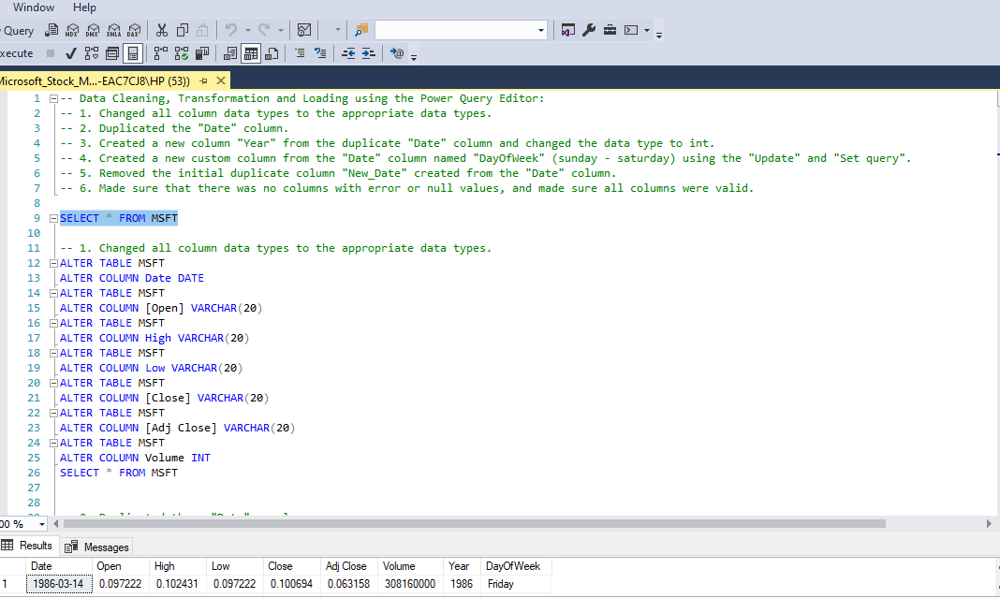

# Microsoft Stock Market (1986-2022) Analysis

 

## Table of Contents
- [Project Overview](#project-overview)
- [Dataset Overview](#dataset-overview)
- [Tools Used](#tools-used)
- [Visualization in Power BI](#visualization-in-power-bi)
- [Project Analysis](#project-analysis)
- [Visuals in Power BI Report](#visuals-in-power-bi-report)
- [Recommendations To Enhance Microsoft's Performance In The Stock Market](#recommendations-to-enhance-microsofts-performance-in-the-stock-market)
 

## Project Overview

### Introduction:
Microsoft Corporation is a U.S.-based American multinational technology corporation producing computer software, consumer electronics, personal computers, and related services headquartered at the Microsoft Redmond campus located in Redmond, Washington, United States. These lists include some well-known software products by Microsoft—the Windows line of operating systems, the Microsoft Office suite of productivity software, and the Internet Explorer and Edge web browsers. Best-selling hardware products are Xbox game consoles and the Microsoft Surface line of touchscreen personal computers. It was ranked No. 21 in the 2020 Fortune 500 rankings of the largest United States corporations by total revenues; it was the world's largest software maker by revenues as of 2019. This makes it one of the Big Five American information technology companies, alongside Alphabet, Amazon, Apple, and Meta.

The **1986-2022 Microsoft Stock Market Analysis** is a project designed to derive insight into the historical performance of Microsoft Corporation stock from its IPO date in 1986 to the end of 2022. Such detailed analysis will answer questions relating to the long-term trends, volatility, newsworthy events, and factors that influenced the stock market performance of Microsoft over a period of more than three decades.

### Objectives:
- Calculate the average open price over time by month for the stock.
- The historical stock average close price for each month has to be worked out.
- To analyze Microsoft's stock volume, on days of the week.
- To identify Microsoft's high, low, and close price trend of stock over time.
- Determine the trend of Microsoft stock price cumulative returns over time.

### Expected Outcomes:
- Gives clarity of the performance of average opening prices every month, the fluctuations, and the past records of it.
- The monthly average closing prices elucidated by the Understanding of which represent historic patterns and fluctuation.
- The specification of the volumes with relation to trading by the weekdays exhibits the level of market action.
- It leads to a possibility of distinguishing the trends in the high, low, and close prices for some period, thereby assisting in the appreciation of the nature of stock volatility.
- The graphs depicting the cumulative returns trend to have somewhat of an indication of the general performance of the investments.
 
 

### Dataset Overview
This dataset contains a Stock Market Analysis of Microsoft Corporation (MSFT) from its Founding / Listing Years which are 1986 to 2022. In this dataset, daily price and the changes within the day can be seen. The highest and lowest prices for every single day help in identifying patterns at the minuscule level. Volume per day is also recorded. The dataset used in this analysis was provided by [Quantum Analytics](https://www.quantumanalyticsco.org/). You can also view the dataset [here](MSFT.csv). It is a .csv file of Microsoft Stock market trades between 1986 and 2022, displaying updates of OHLC (Open, High, Low, Close), Trading Date, Volume, and Adjusted Close. 

The dataset contains 1 sheet/table, 7 columns, and 9,204 rows of data. The data dictionary below expalns the data fields in this dataset:
| Table                              | Field                    | Description                            |            
|:-----------------------------------|:------------------------ |:-------------------------------------- |
|MSFT.csv                            | Open                     | The price at which a stock's first trade occurs when the market opens for the day. It indicates the starting point for trading activity and sets the initial value of the stock for that day.  |
|                                    | High                     | The highest price at which a stock traded during the trading day. It represents the peak value reached by the stock's price within the given timeframe.     |
|                                    | Low                      | The lowest price at which a stock traded during the trading day. It represents the lowest point reached by the stock's price within the given timeframe.         |
|                                    | Close                    | The price at which the last trade occurred when the market closed for the day. It indicates the final value of the stock for that trading session and is often considered significant for technical analysis and decision-making.         |
|                                    | Date                     | The date on which the trading activity occurred, providing a chronological reference for the stock market data.        |
|                                    | Volume                   | The total number of shares of a stock traded during a particular trading day. It indicates the level of activity or liquidity in the market for that stock on that day.         |
|                                    | Adjusted Close           | The closing price of a stock adjusted for factors such as dividends, stock splits, or other corporate actions that may affect the stock's price. This adjusted value helps in providing a more accurate representation of the stock's true performance over time, particularly when comparing historical data.       |
 
 

### Skills Utilized
1. Data Cleaning
2. Data Visualiziation
3. Descriptive Analytics
4. Critical Thinking and Problem Solving
5. Communication and Reporting
 

### Tools Used
1. MS Sql Server
    - Was used to:
        1. Clean
        2. Transform the datasets for this analysis.
           
2. Power BI (Was used to create reports and dashboard for this analysis)
    - The following Power BI Features were incorporated:
        1. DAX
        2. Quick Measures
        3. Filters
        4. Tooltips
 

### Data Cleaning, Transformation and Loading using MS Sql Server:
1. Changed all the field data types to the appropriate data types.
2. Duplicated the __"Date"__ column.
3. Created a new column __"Year"__ from the duplicate __Date__ column and changed the data type to int.
4. Created a new custom column from the __"Date"__ column named __"DayOfWeek"__ (sunday - saturday) using the "Update" and "Set query".
5. Removed the initial duplicate column __"New_Date" __created from the __"Date"__ column.
6. Made sure that there was no columns with error or null values, and made sure all columns were valid.
 

**Raw Data**
- Below a screenshot of a part of the raw data in .csv file format. 

Raw Data Screenshot                                                               |                       
:---------------------------------------------------------------------------------:|

You can preview the dataset [here](MSFT.csv).
 
 

**Cleaned Data MS Sql query screenshot**
- Below is a screenshot of a part of the data cleaning in MS Sql Sever.
  
Sql Query Screenshot                                                               |                       
:---------------------------------------------------------------------------------:|
 

You can preview the MS Sql Server query file [here](Microsoft_Stock_Market_Analysis_Project.sql)
 
 

## Data Modelling
No data modelling was required since we had a single table for the analysis.
 
 

## Visualization in Power BI:
### Report Image
_Analysis_Dashboard.jpg)
 
 

### Project Analysis:
From the analysis, i made the Key Performance findings below:
- The Total Number of Trades is __9,204__.
- Total Traded Volume is __536bn__.
- Average Open Price is __$44.38__
- Average Close Price is __$44.39__.
- Average Adjusted Close Price is __$39.20__.
- Average Price Range is __$0.96__.
 
 

- 

- **Total Volume Traded By Days Of The Week Trend:**
- The following are some of the interesting observations that I have made in my analysis of the total volume traded by days of the week, through the insights generated from the market activity patterns.
- __Peak Trading Days__: Wednesdays and Fridays always turn out to form the days that have the highest volume of trades, with total volumes of 111,675,072,600bn and 111,175,803,100bn, respectively. This finding brings out the underpinning issue of heightened market participation and increased trading activities towards the middle and end of the week.
- __Midweek Momentum:__ Tuesdays and Wednesdays, in particular, form the days of the week that record the highest trading volume. Such a surge in trading volume mid-week may be attributed to factors such as the release of economic data, corporate earnings announcements, or investor positioning ahead of market-moving events.
- __End-of-Week Activity__: Fridays, too, experience high trading volumes, which may be caused by factors such as portfolio rebalancing, options expiry, or profit-taking ahead of the weekend. Traders would like to rebalance their position before the market closes for the week, which may add to the activity on Fridays.
- __Consistent Trends:__ Thursdays and Tuesdays closely range with Wednesday and Friday in total trading volume at 109,479,054,400bn shares and 109,155,926,400bn shares, respectively. This shows the consistency of activities throughout the week as market participants engage themselves in the market on these days too.
- __Monday Lag:__ Mondays do show a considerably lower trading volume against the other weekdays, with a total volume of 94,569,071,100bn. The reason could be many, such as the digestion of news events that occurred during the weekend, which sets off the trading week at a slower pace.
 
 

- 

- **Microsoft Stock Average Open Price Trend By Month:**
- This analysis of the average price that Microsoft stock opened for in each month from 1986 to 2022 reveals quite a few interesting trends and fluctuations.
- __Seasonal Variation:__ The variation in the mean value of opening prices is evidently seasonal over the year. The months, namely, July and August, contain average opening prices significantly higher, at the peak of $46.33 and $47.55, respectively. This may be due to the positive earnings reports, product launches, or market sentiment over the summer.
- __Yearly Trends:__ There seem to be broader trends in the average opening prices throughout the year, apart from the seasonal variation. For example, January to August shows an overall price increase, flattening out to peak in August, before entering a fall during September and October and then flattening out to close the year. This structure refers to market cycles' presence or the investment behavior that may be birthed out of some macroeconomic factor.
- __Outliers and Anomalies:__ Some months deviate far from the general trend. For some, the difference is very visible; for example, October has an average opening price of only $41.39, keeping much lower than the previous months. This would probably be due to certain events happening or market conditions, possibly affecting the performance of Microsoft's stock during that month.
- __Market Sentiment and Events:__ Changes in average opening price could also be used to depict shifts in market sentiment or big events concerning Microsoft Corporation. That is to say that periods of high average opening price could be associated with good news like strong earnings reporting, leading to the launch of a popular product or strategic acquisition.
- __Investor Behavior:__ The perceptions and expectations of investors concerning the future prospects of Microsoft may impact average monthly opening prices. For example, if there are positive news items or optimism about growth prospects, opening prices may be forced upwards. On the contrary, negative news or weak market conditions can have an adverse effect on opening prices.
 
 

- 

- **Microsoft Stock Average Close Price Trend By Month:**
- This plot, which includes the monthly average closing prices of Microsoft stock from 1986 to 2022, has a few patterns and variations worth pointing out.
- __Seasonal Patterns:__ Of equal importance, July and August show the highest average close prices peaking at $46.33 and $47.55, respectively, indicating a seasonal uptrend. This is likely influenced by the prevailing market sentiment during summer.
- __Yearly Variations:__ In general, the average close prices over the years usually follow an upward path from January to August—its peak—and then start to decrease during September and October before leveling off at year-end. This type of cyclic pattern may indicate that there could be cycles in the market forced by macroeconomic factors and investor sentiment.
- __Outliers and Anomalies:__ Months like October, with an average close price of $41.39, are very far away from the general trend. This must have been due to certain events that might have been affecting Microsoft's stock performance within the period.
- __Sentiment and Events of the Market:__ Average close prices are often driven up or down by changes in market sentiment or corporate events. In periods filled with good news, for example, strong earnings or successful product launches, the average close price is higher; in periods with bad news or an uncertain market, the average close price will be lower.
- __Investor Sentiment:__ Investor sentiment is the key driver in establishing month-average closes. Good sentiment, driven by positive news or growth prospects, will tend to drive prices up, and negative sentiment can lead to declines.
 
 

- 

- **Microsoft Stocks High, Low and Close Price Trend Over Time:**
- The series of high, low, and close prices of Microsoft across this time help in unwrapping how the stock has performed, coupled with market dynamics.
- __High-Price Trend:__ Microsoft's high-price indication continued to go uphill over all these years, with minor ups and downs. In 2021, it hit its highest peak exactly at $70,060.54. This simply indicates the general success of the firm and market perception toward the growth potential.
- __Low Price Trend:__ The low prices of Microsoft have also generally been moving upwards, with occasional dips. The lowest was in 1986 at $23.51, and from that point onwards, the low prices kept moving up, showing improvement in stability in the market and faith in Microsoft's performance with time.
- __Close Price Trend:__ The close prices of the Microsoft stock also depict a continuous upward trend, reflecting the increasing business and merchandise profitability of the company. The highest close price was achieved in 2021 at $69,537.07—this represents that the confidence of investors is being upheld and there were positive market sentiments about Microsoft.
- High, low, and close price trends indicate that Microsoft has grown and is very resilient to the stock market; this is what the analysis reveals. Such insights will assist investors in ascertaining the historical performance of the stock to make decisions regarding the adoption of any investment strategy.
 
 

- 

- **Microsoft Stocks Prices Cumulative Returns Trend Over Time:**
- An increasing trend in the cumulative return of Microsoft stock price over time might mean something relating to the general performance and the growth trajectory of the stock.
- __Steady Growth:__ Cumulative returns of Microsoft have increased every year, thus proving the long-term success and fleshing out value appreciation of the firm. The cumulative returns have moved steadily up from $14.99 in 1986 to $50,056.25 in the year 2022; hence, high wealth creation for investors within the analyzed period.
- __Accelerating Growth:__ The growth rate of cumulative returns has increased over the years, particularly during the late 1990s. It was the period when various key events and developments occurred in Microsoft related to entering new markets, making strategic acquisitions, and introducing innovative technologies.
- __Market Resilience:__ The cumulative returns in Microsoft portrayed resilience, recoverability, and continuity tending upward, despite downturns at times and market fluctuations. This resilience represents the powerful fundamentals of the company, diversified streams of revenue generation, and the ability to be adaptive with respect to changing markets.
- __Outperformance:__ Cumulative returns of Microsoft generally outperform the broad market indices and benchmarks, underlining the exceptional performance of the company vis-à-vis its peers and the general market. This outperformance values Microsoft's position as a lead technology player and its ability to deliver value to shareholders over time.
- __Investment Potential:__ The trend of the cumulative returns demonstrates that the Microsoft stock has been a very rich investment for the long-term investor, offering him a significant return and capital appreciation. This may attract the interest and confidence of more investors in the future growth prospects of Microsoft.
 
 

- 

- **Microsoft Stock Traded Volume Over Time:**
- In this analysis, I analyzed the volume of Microsoft stock traded with respect to time, providing insights into market activity and investor interest:
- __Historical Trends:__ The volume of Microsoft stock traded has changed over the years, reflecting changes in market conditions, investor sentiment, and company performance. From very low volumes in 1986 to 2022, levels of trading have shifted appreciably higher, reaching peaks at other times and troughs.
- __Peak Years:__ There were a few of those years that gave out exceptionally high traded volumes; such high volumes trad­ed indicate a heightened market activity and hence that level of investor participation. This includes the year 1987, which surged consider­ably to a traded volume of 23,920,171,200bn shares. This was also caused by major mar­ket events, like the stock market crash of that year.
- __Recent Trends:__ Traded volumes generally show a decline in the last decades compared to previous decades that ended with 5,690,658,600bn shares traded in 2022. However, year-over-year fluctuations still subsist, attesting to the persistence of market dynamics and changes in investor behavior.
- __Market Sentiment:__ The traded volume normally pictures the sentiment or interest of investors in a particular stock. Heavier volumes could mean heightened confidence—sometimes mere speculation by investors—whereas lower volumes could mean more caution or a lack of interest.
- __Investor Implications:__ Knowing the trends in traded volume will enable the investors to not only understand market sentiment but further value possible trading opportunities. High volumes can present opportunities for short-term trading or liquidity, and low volumes may signal a lack of interest from the markets or potential price volatility.
 
 

- 

- **Microsoft Stock Prices Trend Over Time:**
- The trend analysis of Microsoft stock prices over time shows several important insights into growth and volatility, which I have shared below:
- __Continuous Growth:__ the stock price of Microsoft grew from $23.89 in 1986 to $50,233.47 in 2022. The nature of this positive trend in its stock price indicates that the firm has been doing great and has been innovative enough to top the technology market.
- __Volatility:__ The stock prices of Microsoft show periods of volatility and fluctuations despite the overall upward trajectory. For instance, there are visible fluctuations in the first early years before later more stable growth in trajectory. The volatility, therefore, could be influenced by several factors such as market conditions, company earnings, and industry trends.
- __Milestone Years:__ Within Microsot's several years of stock prices trend, includes a couple of trends that stand out from Microsoft's history. 1999 in particular, was a year of steep price growth to $11,029.22, while 2021 saw an increase in the value of the stock price to $69,537.07 in the past year due to great financial performance and inspired optimism among investors.
- __Market Response:__ The stock prices of Microsoft respond to such crucial events and announcements as product launches, earnings reports, and strategic actions. Good news rockets the prices up, while negative news leads to abrupt but short-lived drops in its stocks.
- __Long-Term Investment:__ Despite short-term fluctuations, Microsoft's stock price trend portrays an overall trend that proves the company's long-term resilience and growth potential. 
 
 

## Visuals in Power BI Report:
You can view and interact with this dashboard report on Microsoft Stock Market (1986-2022) Analysis project [here](https://app.powerbi.com/view?r=eyJrIjoiMmM5ZTJiYTEtNTdlMi00ZDY5LWJjMWItODdhNzUzMzQ4NDM4IiwidCI6IjdlYzI5NjU5LTNjZjItNGYzZi1hYmIzLWE3MjJlZGY3ZmYyZCJ9).
 
 
 

## Recommendations To Enhance Microsoft's Performance In The Stock Market:
-  __Invest in Innovation:__ Microsoft should continue investing in research and development, which will lead to more innovations across its product and service offerings. The company needs to continue improving its technologies, they should monitor trends across the market, and assure investors with support for long-term growth.
- __Cloud Services:__ Microsoft should continue to upgrade its technologies, which will enable it to stand out in the cloud computing and digital transformation solutions marketplace.  The company needs to continue building up its firm or robust offerings in progress, like Azure and Microsoft 365, to reach its set objectives in revenue growth and market compatibility.
- __Strategic Acquisitions:__ Microsoft should look into strategic acquisitions that are geographically or technologically relevant, that complement its prevailing portfolio, and then extend the same to new markets. This would propel growth and access to the innovation of new technologies and customer segments for innovative start-ups or established companies on the part of the target through such an acquisition.
- __Diversification:__ Microsoft needs to look at moving streams of revenues away from the classic model of software licensing. It has tremendous opportunities to capitalize in respect to subscription-based services, gaming, artificial Intelligence, and cybersecurity in a bid to capitalize on emergent trends in market demand.
- __Sustainable Business Practices:__ It should incorporate in its business, sustainable business and ESG practices which will contribute to the reputation of Microsoft and attract socially responsible investors.
- __Improved Communication:__ Microsoft needs to continuously increase its openness and clarity in communicating financial performance, strategy initiatives, and best practices in corporate governance to the investors. This will help in fostering trust and confidence between investors and Company leadership.
- __Global Growth:__ Microsoft can take the opportunity to enroll in the growth prospects available in developing countries by further increasing its presence in strategic locations that will hence propel growth. This will be within product and service offerings tailored toward regional markets, and also those strategic relationships sighted to aid in the enablement of market penetration and diversified income streams.
 
 

## Thank You For Following Through!

